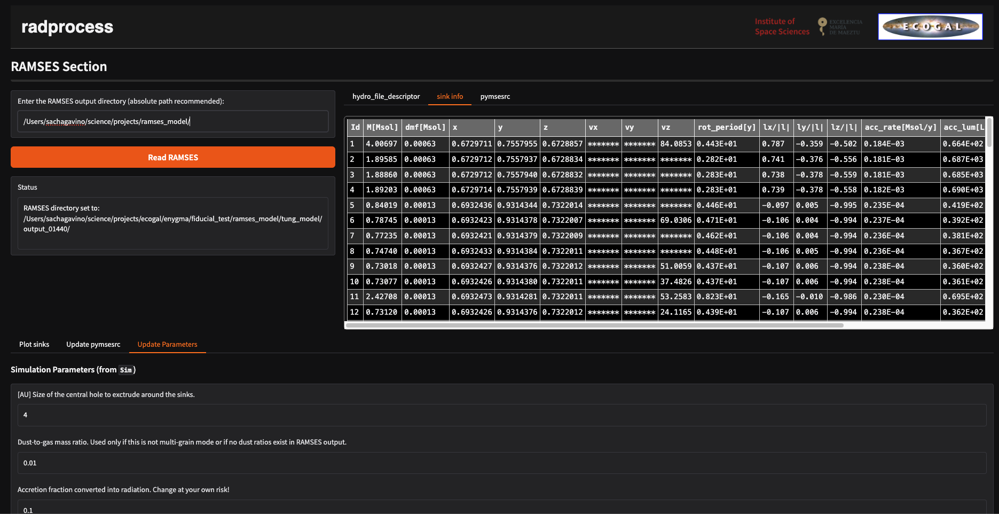

# radprocess Version 0.1.0

## Introduction
RadProcess is a pipeline that converts RAMSES output for radiative tranfer postprocessing. 
It is usable from a notebook, can be run on your cluster. If the user is interested, it can also work from a web graphical interface (Gradio), which provides an intuitive way to build and run your postprocessing pipeline (see the documentation).

<!-- Here is the pipeline graphical user interface dashboard: -->

<!-- <picture>
  <source srcset="radprocess/interface/_static/dashboad_gr_pipeline.png" media="(prefers-color-scheme: dark)">
  
</picture> -->

## User's guide
The file INSTALL.md provides the full installation procedure. Alternatively, it is also possible to read the installation procedure and a how-to-use Radprocess in the documentation [here][1].

## External requirements (not installable via pip):

- RAMSES
- RADMC3D 2.0
- POLARIS v4.13
- PyMSES (see custom fork)

## Branches
main: stable up-to-date version.

dev: use it at your own risks.

## News
[11.06.2025]: Includes multiple dust populations

[1]: https://radprocess.readthedocs.io/en/latest
