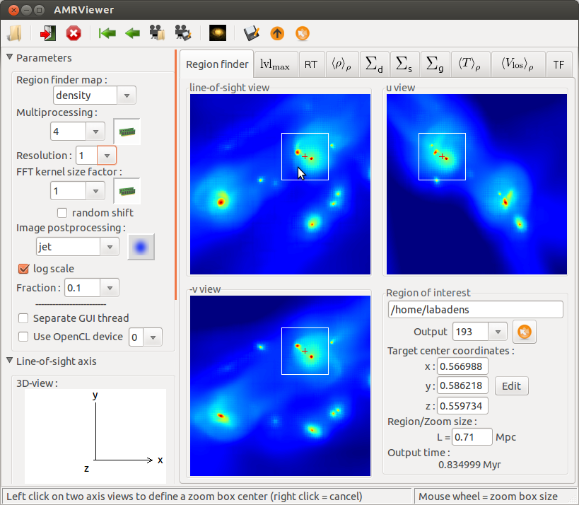
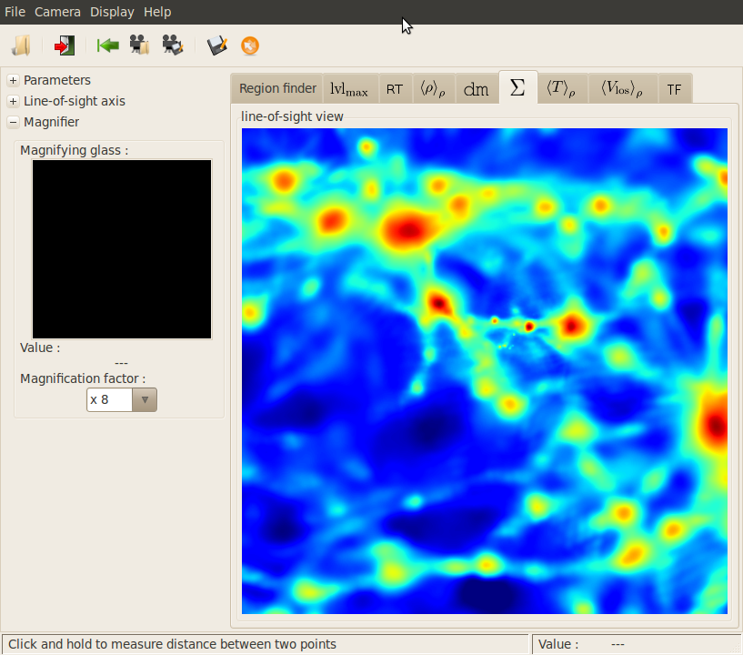
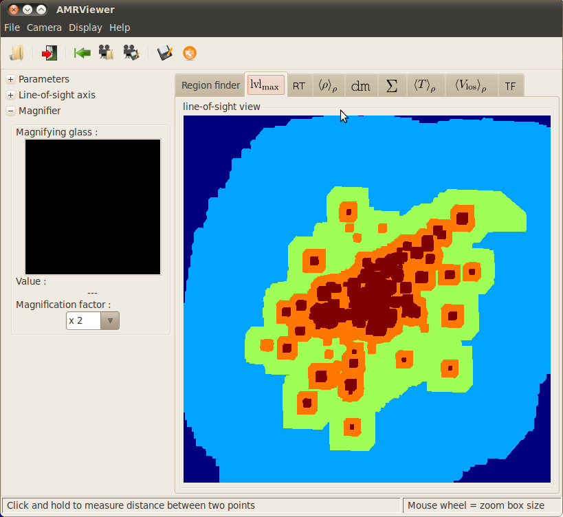
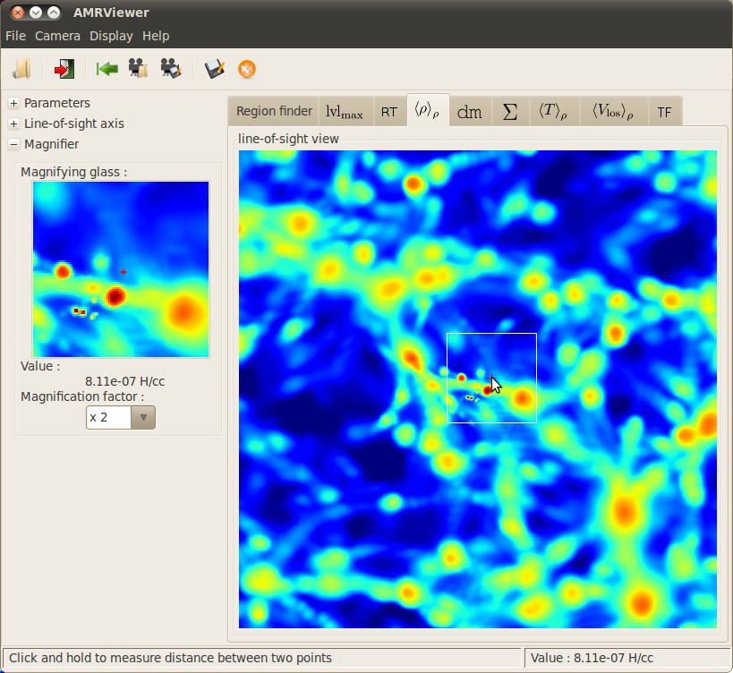
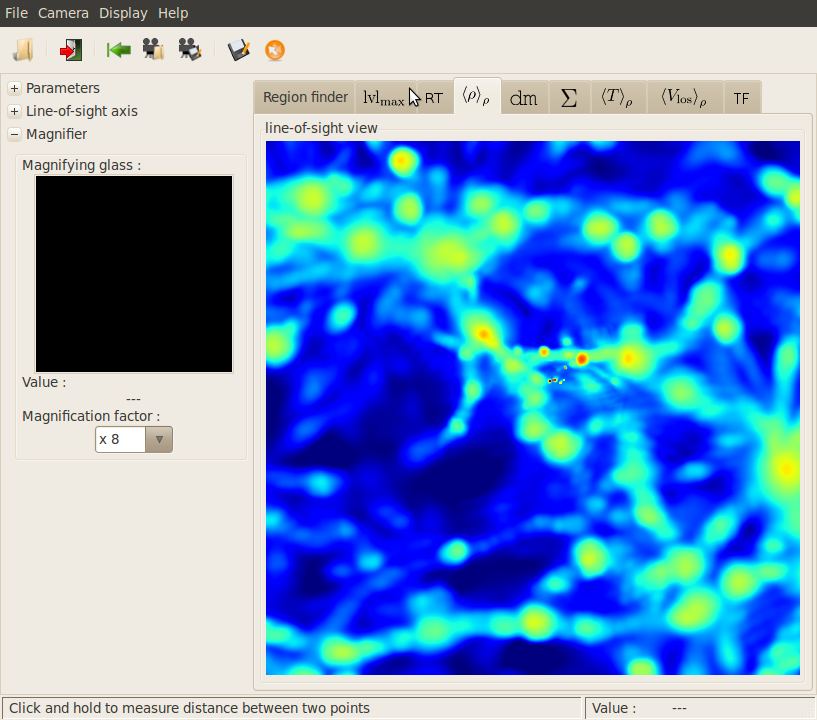
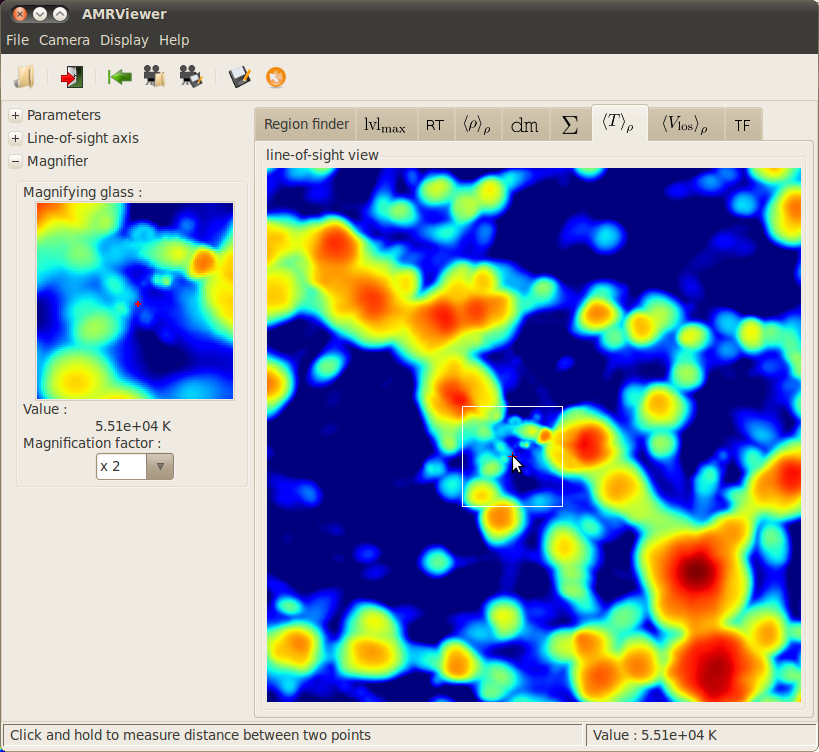
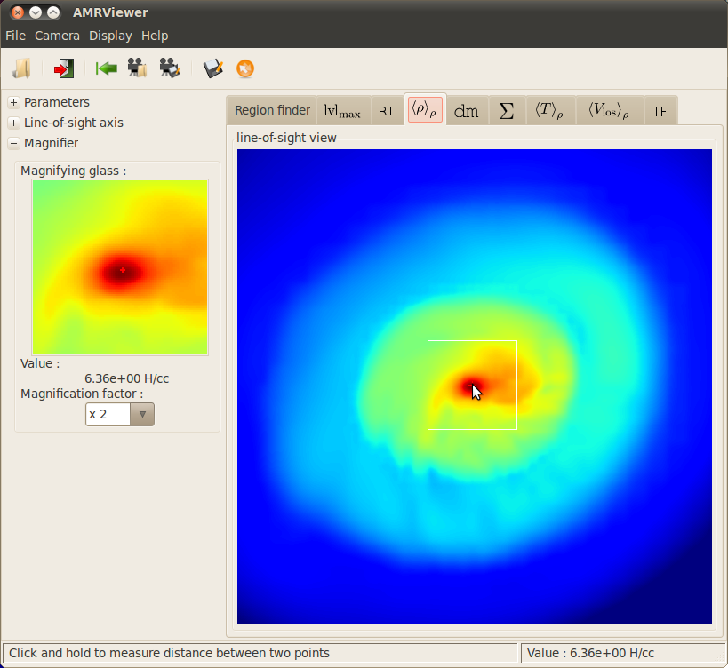
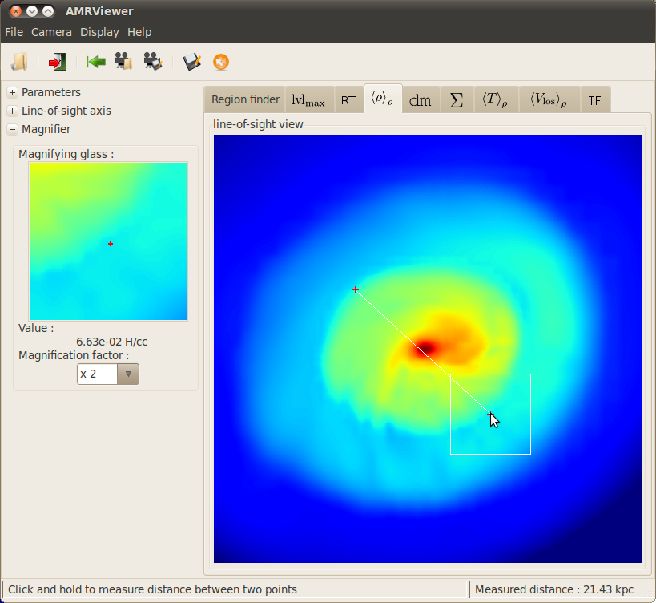

###########
Screenshots
###########

Some images out of PyMSES :

	|AMRViewer|	|Gas-Surface-Density-AMRViewer|	|levelMaxRayTrace-AMRViewer|	|mass-weighted-AMRViewer|	|Mass-weighted-density-AMRViewer|	|temperature-AMRViewer| |magnifier-AMRViewer| |rule-AMRViewer|

