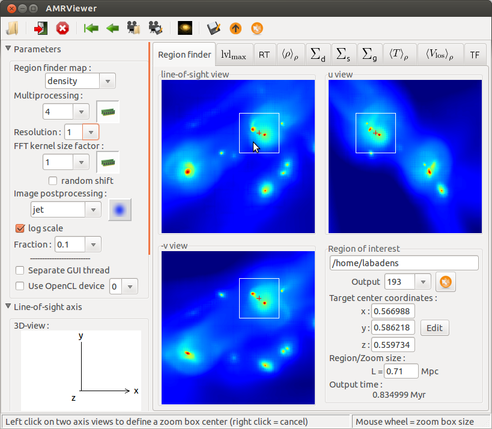
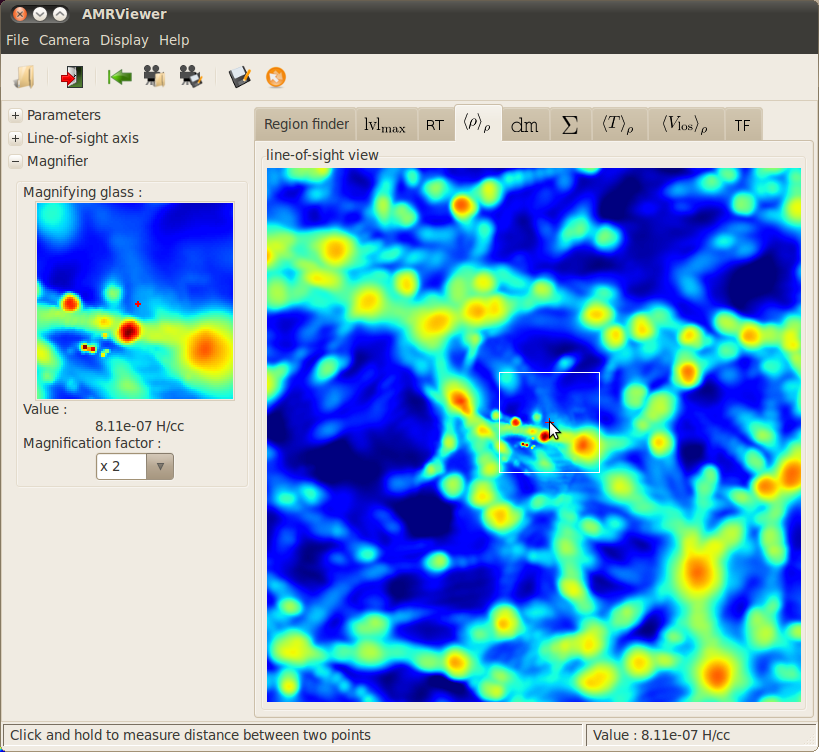
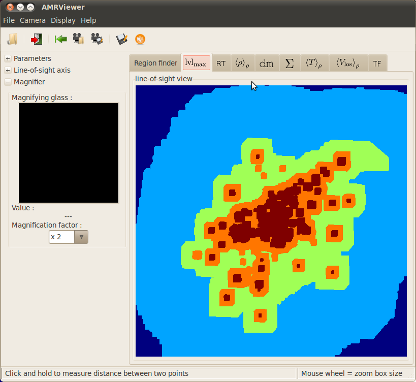

*************
AMRViewer GUI
*************

Starting the GUI
-----------------

PyMSES has a Graphical User Interface (GUI) module which can be used to navigate into AMR data. Once installed as described in :doc:`ug_installing`, the GUI can be started with the following python prompt commands::

    from pymses.analysis.visualization import AMRViewer
    AMRViewer.run()

Loading AMR data
-----------------
	
To load some data, a Ramses outputs folder has to be selected via the toolbar button or the menu.

The required output number can be specified with the output number list on the left of the main window

Playing with the camera
-----------------------

The camera parameters can be adjusted with the line-of-sight axis expander. You can drag-and-drop the line-of-sight axis to modify it interactively. You can also press ``Ctrl`` while dragging the axes to perform a rotation around the line-of-sight axis.

A few convenient shortcuts have been added to this menu. 

	
There is a possibility to save and load camera parameter via the ``Camera`` menu bar.

The Region Finder
-----------------

The `update view` button is the trigger to actually read and process the data. Progress can then be seen in the command prompt, until the view has been totally computed. 

	

.. topic:: Navigation

    The AMRViewer Region finder is made to navigate through data. Left clicks set the zoom center/zoom box size while right clicks unset them. Mouse wheel let you adjust the zoom box size.

Other map types, other tabs
---------------------------

Some other map types can be processed and seen through other tabs as suggested in the `display` menu:

For example, gas surface density projected map (see :doc:`ug_visu_fft`):  

.. image:: _images/Gas-Surface-Density-AMRViewer.png
    :target: _images/Gas-Surface-Density-AMRViewer.png
    :width: 400

Mass weighted gas density map (see :doc:`ug_visu_fft`):

l

Max. AMR level of refinement along the line-of-sight map (see :doc:`ug_visu_raytrace`):         

l

Magnifier
*********

The `magnifying glass` tool can then be used to see the exact value on the map:   

.. image:: _images/MagnifyingGlass-AMRViewer.png
    :target: _images/MagnifyingGlass-AMRViewer.png
    :width: 400

Rule
****

The `rule` tool can be used to measure distances on the maps (click-and-drag behavior):   

.. image:: _images/rule_AMRViewer.png
    :target: _images/rule_AMRViewer.png
    :width: 400

