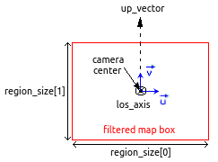
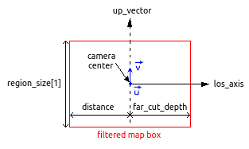
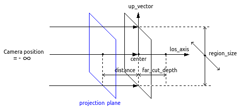
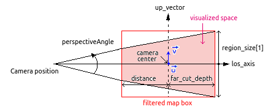
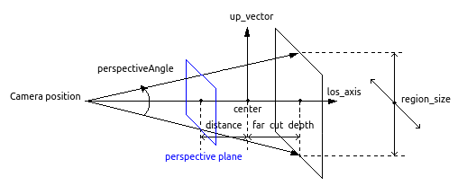

Camera and Operator
###################

Camera
======

To do some data visualization, the view parameters are handled by a :class:`~pymses.analysis.visualization.Camera`::

    from pymses.analysis.visualization import Camera
    cam  = Camera(center=[0.5, 0.5, 0.5], line_of_sight_axis='z', region_size=[0.5, 0.5], distance=0.5,
        far_cut_depth=0.5, up_vector='y', map_max_size=512, log_sensitive=True)

This object is then used in every PyMSES visualization tool to render an image from the data.

The standard isometric (parallel rays) camera is :

* centered around **center**
* oriented according to a **line_of_sight_axis** pointing towards the observer and an **up_vector** pointing upwards (in the camera plane)
* delimited by a **region_size** in the directions perpendicular to the camera plane. region_size[0] defines the size along the u camera horizontal vector, and region_size[1] defines the size along the v camera vertical vector
* delimited by front/background cut planes at position **distance**/**far_cut_depth** along the line-of-sight axis
* built with a virtual CCD-detector matrix of max. size **map_max_size**

- PyMSES camera box filtering definition :

There is now a possibilty to transfom the standard pymses isometric view into a perspective view using the perspectiveAngle option (which uses degree unit). The default value "0" correspond to the isometric view, while a non zero value for this angle will set a perspective view as presented on the following figures :

- PyMSES perspective camera :

Notice that with this perspective camera definition, the filtered space is the same as the one of the isometric camera but the visualized space is restricted.

Saving / loading a Camera
-------------------------

Camera can be saved into a CSV file::

    from pymses.analysis.visualization import Camera
    cam  = Camera(center=[0.5, 0.5, 0.8], line_of_sight_axis='y', region_size=[0.5, 0.8], distance=0.2)
    cam.save_csv("my_cam.csv")

It can also be loaded from a CSV file to retrieve a previous view::

    from pymses.analysis.visualization import Camera
    cam = Camera.from_csv("my_cam.csv")

Other utility functions
-----------------------
The camera definition can be used to know the maximum Ramses AMR level up needed to compute the image map::

    level_max = cam.get_required_resolution()

To do further computation we can also get the pixel surface from the camera object::

    pixel_surface = cam.get_pixel_surface()

We can get some camera oriented slice points directly from the camera (see :doc:`ug_visu_slices`)::

    slice_points = cam.get_slice_points(z)

Operator
========

For every PyMSES visualization method you might use, you must define the physical scalar quantity you are interested in.

For example, you can describe the kinetic energy of particles with the :class:`~pymses.analysis.operator.ScalarOperator`::

    import numpy
    from pymses.analysis import ScalarOperator
    def kin_en_func(dset):
        m = dset["mass"]
        v2 = numpy.sqrt(numpy.sum(dset["vel"]**2, axis=1))
        return m*v2
    kin_en_unit = ro.info["unit_mass"]*ro.info["unit_velocity"]**2
    Ek = ScalarOperator(kin_en_func, kin_en_unit)

You can also define :class:`~pymses.analysis.operator.FractionOperator`. For example, if you need a mass-weighted temperature
operator for your AMR grid (splatting method using FFT convolution)::

    
    from pymses.analysis import FractionOperator
    M_func = lambda dset: dset["rho"] * dset.get_sizes()**3
    def num(dset):
        T = dset["P"]/dset["rho"]
        M = M_func(dset)
        return T * M
    mw_temp_unit = ro.info["unit_temperature"]
    op = FractionOperator(num, M_func, mw_temp_unit)

If you want to ray-trace the max. AMR level of refinement along the line-of-sight, use :class:`~pymses.analysis.visualization.MaxLevelOperator`.
